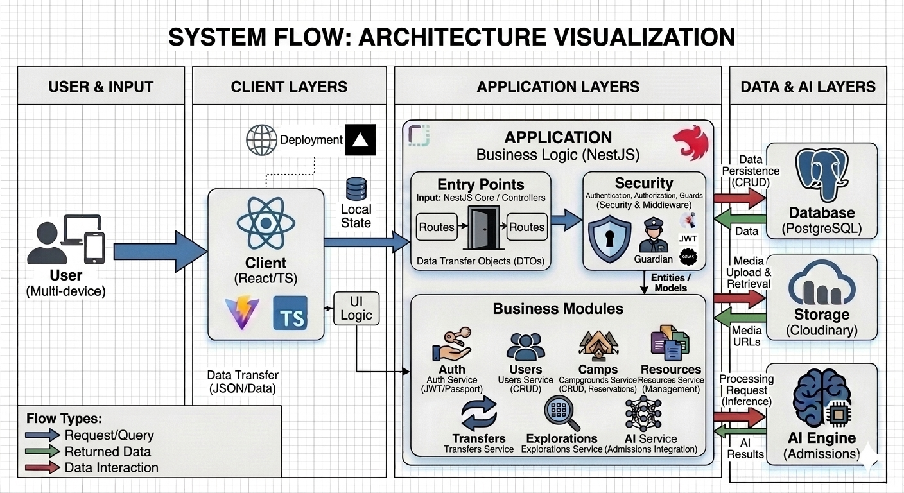
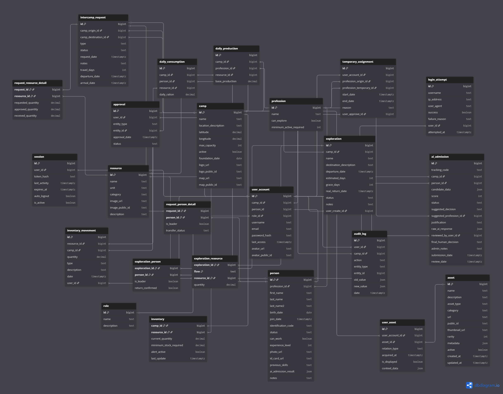

<div align="center">
  
  
  
  
  
</div>

<h1 align="center">⚙️ Doomsday System API (Gestión del Fin)</h1>

<p align="center">
  <strong>The core backend engine powering the Doomsday System.</strong>
  <br />
  A robust, enterprise-grade RESTful API built with NestJS to manage critical resources, personnel, and communications between outposts in a post-apocalyptic world.
</p>

<p align="center">
  🌐 <strong>Production API:</strong> <a href="https://doomsday-system-api.onrender.com/api/v1">https://doomsday-system-api.onrender.com/api/v1</a>
</p>

---

## 📖 Overview

The **Doomsday System API** is the foundational backend infrastructure for the *Gestión del fin* ecosystem. It handles all business logic, data persistence, and inter-camp communication strategies safely and reliably.

Built upon the powerful **NestJS** framework, this backend leverages decorators, dependency injection, and heavy TypeScript typing to ensure a scalable and strictly validated data flow.

## 🏗️ Architecture & Design

To ensure technical transparency and compliance with design requirements, the following diagrams are presented:

### 🧩 System Architecture
Visual representation of the data flow between the Client (React), the Server (NestJS), and External Services (AI, Cloudinary, Database).



### 📊 Data Design (ERD)
The data model is normalized and designed to support multi-camp environments, resource traceability, and health status tracking.

- **Interactive Diagram:** [dbdiagram.io - Doomsday System](https://dbdiagram.io/d/6893dfbedd90d17865cbf822)


*(Click the link above to view live detailed relationships)*

---

## ✨ Key Features

- **🔐 Enterprise Security:** Secure JWT-based authentication with properly managed environment configurations (no hardcoded credentials). Session auto-logout after 20 minutes of inactivity.
- **🏕️ Camp Resource Orchestration:** Endpoints dedicated to tracking, allocating, and updating physical and human resources across multiple camp instances.
- **📡 Inter-Camp Transfers:** Facilitates resource and personnel transfers between distinct geographical nodes with a strict dual-approval flow (origin & destination).
- **🗺️ Explorations:** Full lifecycle management of scouting missions — scheduling, dispatch, and return with found resources.
- **🤖 AI Admissions:** Automatic candidate evaluation via integrated AI microservice with transparent justification and human review override.
- **🚦 API Standardization:** All endpoints standardized under `/api/v1` with clean RESTful architecture and Swagger documentation.
- **🛡️ Strict Validation:** Complete Request/Response schema validation using DTOs and `class-validator`.
- **🧪 Comprehensive Testing:** 724 unit tests (Jest) + 44 E2E tests (Playwright) covering all critical flows.

## 🛠️ Technology Stack

| Layer | Technology |
|---|---|
| Framework | [NestJS](https://nestjs.com/) (Node.js) |
| Language | [TypeScript](https://www.typescriptlang.org/) |
| Database | PostgreSQL (via TypeORM) |
| Unit Testing | [Jest](https://jestjs.io/) + ts-jest |
| E2E Testing | [Playwright](https://playwright.dev/) (API mode) |
| Validation | class-validator & class-transformer |
| Auth | JWT (Passport) |
| Infrastructure | Render (Server) & Supabase (Database) |

---

## 🚀 Getting Started

### Prerequisites

- Node.js v18+
- npm v9+
- PostgreSQL instance (or use the shared Supabase DB)

### Installation

```bash
# 1. Clone the repository
git clone https://github.com/keylorpineda/ProjectProgrammingIV-BackEnd.git
cd ProjectProgrammingIV-BackEnd

# 2. Install dependencies
npm install
```

### Configure Environment Variables

Copy `.env.example` to `.env` and fill in your values:

```bash
cp .env.example .env
```

---

## 🧪 Testing

### 📋 Quick Reference

| Command | Description |
|---|---|
| `npm run test` | Unit tests (Jest) — 724 tests total |
| `npm run test:cov` | Unit tests with coverage report |
| `npm run test:playwright` | E2E tests against specified `API_BASE_URL` |
| `npm run test:playwright:ui` | E2E tests with Playwright's UI Mode |
| `npm run test:playwright:report` | Opens the last HTML test report |

---

### 🔬 Unit Testing (Jest)

Executes all `.spec.ts` modules inside `src/`. Does not require an active server or database.

```bash
npm run test
```

**Expected Result:**
```
Test Suites: 63 passed, 63 total
Tests:       724 passed, 724 total
Time:        ~18s
```

---

### 🎭 E2E Testing (Playwright)

E2E tests validate full HTTP flows. Located in `e2e-playwright/`, covering:

| File | Flows |
|---|---|
| `auth.spec.ts` | Login, refresh, session status, 401 handling |
| `dashboard-camps.spec.ts` | Camp CRUD, dashboard metrics |
| `resources.spec.ts` | Inventory, movements, pagination |
| `transfers.spec.ts` | Inter-camp requests, dual approval, arrivals |
| `explorations.spec.ts` | Creation, departure, return with resources |
| `users.spec.ts` | AI Admission, human review, status changes |

#### ▶️ Option A — Against Production (Render)

> ✅ **Recommended.** Does not require local setup.

**PowerShell:**
```powershell
$env:API_BASE_URL="https://doomsday-system-api.onrender.com/api/v1"; $env:TEST_USERNAME="admin"; $env:TEST_PASSWORD="Admin@1234!"; npm run test:playwright
```

**Bash (macOS / Linux):**
```bash
API_BASE_URL=https://doomsday-system-api.onrender.com/api/v1 TEST_USERNAME=admin TEST_PASSWORD="Admin@1234!" npm run test:playwright
```

---

#### ▶️ Option B — Against Local Server

**Step 1 — Configure your `.env`:**
```env
API_BASE_URL=http://localhost:3000/api/v1
TEST_USERNAME=admin
TEST_PASSWORD=Admin@1234!
```

**Step 2 — Start the server:**
```bash
npm run start:dev
```

**Step 3 — Run tests (in another terminal):**
```bash
npm run test:playwright
```

---

## 📂 Architecture Overview

```text
src/
 ├── ai/             # AI logic and Admission evaluation
 ├── auth/           # JWT security, guards, and session management
 ├── camps/          # Outpost management and dashboard metrics
 ├── explorations/   # Mission lifecycle (Scouting/Exploration)
 ├── health/         # System status and Server Time
 ├── resources/      # Inventory and resource movement
 ├── transfers/      # Inter-camp communication and transfers
 ├── users/          # Personnel, roles, and professions
 ├── common/         # Shared filters, interceptors, and decorators
 ├── main.ts         # Application entry point
 └── app.module.ts   # Root module
```

---

## 📄 License

This project is licensed under the MIT License.
